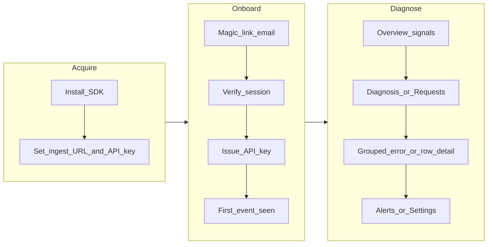

# AutoPulse — Full Product / UX / UI / DX Audit and Roadmap

**Audience:** Product, design, engineering
**Date:** 2026-05-05
**Sources:** `DEVELOPMENT.md`, `README.md`, `backend/src/autopulse_backend/**`, `frontend/**`, `sdk/src/autopulse/**`
**Note:** This document is an engineering audit artifact. It does **not** change canonical scope in `DEVELOPMENT.md`; where code exceeds documented MVP, that is called out as **drift** for maintainer decision.

---

## 1. Executive summary

AutoPulse today is **stronger than the written MVP** in several areas (diagnosis views, constrained log query, multi-channel alerts, org/RBAC, OIDC hooks, extended metrics, SDK widgets, WebSocket fan-out). It is **weaker than “Grafana + Datadog parity”** by design in `DEVELOPMENT.md` (no distributed tracing as a first-class product, no arbitrary query language / dashboard builder at platform level, no full APM agent story).

Your stated direction — **one line of code** plus **as much observability value as possible** — is achievable as a **layered product**: a **default path** that stays “two minutes to signal,” with **progressive disclosure** for power features (SQL-scoped filters, orgs, webhooks, extended charts). The main risks are **UX fragmentation** (multiple scope/filter paradigms), **copy that promises tracing** where the product does not deliver it, and **surface area** (Settings, legacy vs phased overview) that can undermine the “refuses to configure observability” positioning.

---

## 2. Strategic framing

### 2.1 Product promise (canonical)

From `DEVELOPMENT.md`:

- **Core question:** “What broke, when did it break, and what requests led to it?”
- **Rule:** If a feature makes users think like observability engineers, it does not belong in the MVP.
- **Explicit non-goals (MVP):** distributed tracing, custom dashboard builder, query language, complex alert rules, K8s/multi-cloud, log pipelines, full APM, enterprise permissions/audit logs.

### 2.2 Your direction (stakeholder)

- **One-line integration** remains non-negotiable.
- **Maximize capability** toward more mature systems (Grafana/Datadog-class *utility*, not necessarily *surface area*).

### 2.3 Reconciliation

| Grafana/Datadog concept | AutoPulse stance |
|---------------------------|------------------|
| Arbitrary dashboards | Opinionated fixed views + **SDK-defined widgets** (programmatic, not a UI builder) |
| Log/metric query languages | **Constrained filters** + optional **advanced/SQL-scoped** query (borderline vs non-goal; keep gated) |
| Traces | **Not** a first-class trace product per spec; request/error correlation only unless strategy changes |
| Alerting | Heuristic spike/outage + multi-channel delivery — already broader than “email only” MVP text |
| Enterprise IAM | OIDC + orgs/RBAC — overlaps “enterprise non-goals” wording but is lighter than full enterprise suites |

---

## 3. Capability matrix

Legend: **Done** = implemented and user-visible · **Partial** = exists but incomplete, gated, or UX-weak · **Missing** = not found as product feature · **Overbuilt** = exceeds narrow MVP doc / risk to simplicity

### 3.1 SDK (`sdk/src/autopulse`)

| Capability | Status | Notes |
|------------|--------|--------|
| FastAPI / Starlette middleware | **Done** | `monitor()`, `autopulse()` |
| Bounded async queue + drop when full | **Done** | `_monitor.py`, tests |
| Background batching + retries + silent failure | **Done** | gzip over threshold; 401 not retried |
| Re-raise original exception after capture | **Done** | |
| Default scrub keys; optional headers/query capture | **Done** | `DEFAULT_SCRUB_KEYS` |
| Stable error hash (line-number normalization) | **Done** | `_stable_error_hash` |
| Remote ingest only (embedded deprecated) | **Done** | |
| Custom dashboard widgets in payload | **Done** | `widgets.py` — **Overbuilt** vs minimal MVP list |
| Infrastructure (psutil) metrics + probe loop | **Partial** | Valuable; optional warning path; **Overbuilt** for “zero config” narrative |
| Request sampling | **Missing** | Listed “build soon” in `DEVELOPMENT.md` |
| Route ignore list (e.g. `/health`) | **Missing** | Backend may exclude AutoPulse-internal traffic; generic health ignore not a first-class SDK knob |
| Single DX story (`monitor` vs `autopulse`, env defaults) | **Partial** | Two entry points; fixture README env names may drift from real vars |
| Wheel size / bundled `ui/` | **Partial** | Packaging may ship large static tree — DX/artifact tradeoff |

### 3.2 Backend — ingest & security

| Capability | Status | Notes |
|------------|--------|--------|
| `POST /ingest` + dashboard router under `/dashboard` | **Done** | `api/router.py` |
| API key auth; hashed storage | **Done** | `auth/api_keys.py` |
| Pydantic validation; server metadata | **Done** | `schemas/ingest.py`, ingest pipeline |
| Rate limits, size limits, idempotency | **Done** | `routes/ingest.py`, ingestion limits |
| Event store (DuckDB default / SQLite fallback) | **Done** | `services/event_store.py`, config |
| Per-minute aggregates + error groups | **Done** | ingest + workers |
| Plan-based ingest multiplier | **Partial** | `commercial/plan_limits.py` — productization without full billing story |
| HTTPS enforcement / CORS / origin middleware | **Done** | `app.py`, config |

### 3.3 Backend — dashboard API

| Capability | Status | Notes |
|------------|--------|--------|
| Overview + extended overview (percentiles, Apdex, breakdowns) | **Done** | **Overbuilt** vs one-screen MVP wording |
| Requests list + filters + `event_sql_filter` | **Done** | |
| Error groups + sample stack | **Done** | |
| Diagnosis routes (timeline, failures, drill-down) | **Done** | Strong fit for “five second diagnosis” |
| Log query validate/execute | **Done** | **Partial/Overbuilt** vs “no query language” non-goal — constrained DSL |
| Widgets API | **Done** | |
| Bootstrap / query bundle | **Done** | Performance-oriented |
| WebSocket `/dashboard/updates` | **Partial** | Exists; UI adoption / stream completeness varies |
| Magic link + session + API key lifecycle | **Done** | `auth_routes.py` |
| OIDC | **Done** | Optional SSO track |
| Organizations, invites, RBAC, audit-style events | **Done** | **Overbuilt** vs “enterprise non-goals” literal text |

### 3.4 Backend — alerts, jobs, retention

| Capability | Status | Notes |
|------------|--------|--------|
| Error spike + outage heuristics | **Done** | `alert_service.py` |
| Email + webhook + Slack + Discord | **Done** | Ahead of “email MVP” text |
| Retention cleanup + scheduler / leases | **Done** | `jobs/`, `maintenance/` |
| Cron/job observability | **Partial** | Minimal: `type=job` ingest + overview/diagnosis failure strip + SDK helper; not a full cron scheduler product |

### 3.5 Frontend — pages & chrome

| Route / area | Status | Notes |
|--------------|--------|--------|
| `/` → `/dashboard` | **Done** | |
| Onboarding | **Done** | Key + first event |
| Overview `/dashboard` | **Done** | Phased “lite” vs legacy — **Partial** complexity |
| Diagnosis `/diagnosis` | **Done** | Grouped errors, guided panel |
| Requests `/requests` (`/logs` redirect) | **Done** | “Logs” mental model vs nav label |
| Alerts `/alerts` | **Done** | Operator copy (“M5”) may feel enterprise-y |
| Settings `/settings` | **Done** | Large multi-section — **Overbuilt** for solo narrative |
| Widgets showcase | **Done** | Dev/advocacy surface |
| Magic link auth | **Done** | |
| Empty/error boundaries | **Partial** | Generic “no data” vs misconfig |

---

## 4. User flows and UX/UI/DX coverage

### 4.1 Primary flows (happy path)

| Flow | Coverage | Gaps / friction |
|------|----------|-----------------|
| Install → first event in UI | **Strong** | Remote ingest requires env; doc ideal shows `monitor(app)` only |
| Auth → onboarding gate | **Strong** | Forced routing in layout; good |
| Overview → “what’s wrong?” | **Strong** | Phased vs legacy dual mental model; some deep links omit persisted scope |
| Requests → expand → diagnosis | **Strong** | Toolbar vs overview facet board inconsistency |
| Alerts → configure delivery | **Medium** | Split between Alerts and Settings; acceptable but easy to lose |
| Org invite / RBAC | **Strong** | Heavy for smallest teams; needs progressive disclosure |

### 4.2 Edge / failure flows

| State | Coverage | Gap |
|-------|----------|-----|
| No session | **Good** | Magic link recovery |
| Ingest misconfigured (SDK) | **Partial** | Warnings + no-op; dashboard “no data” may not explain ingest URL/key mismatch |
| Backend down | **Good** (SDK) | User app healthy; dashboard shows errors |
| Empty project (no traffic) | **Good** | Onboarding pointer |
| Advanced query / SQL filter misuse | **Partial** | Validate endpoint helps; UX depends on env flag |

### 4.3 UX/UI findings (severity-ordered)

1. **High — Positioning drift:** Copy referencing “traces” or trace-like workflows where product is request/error-centric (`GuidedTroubleshootingPanel` and similar) undermines trust.
2. **High — Scope UX fragmentation:** `OverviewScopeFacetBoard` vs `ServerQueryToolbar` teaches two different mental models for the same dimensions (time, env, service, status).
3. **Medium — Deep links:** Phased overview links to diagnosis may not always carry the same query string as legacy paths (scope round-trip).
4. **Medium — Naming:** `/logs` → `/requests` redirect vs sidebar “Requests” vs user word “logs.”
5. **Low — 404:** Limited guidance toward diagnosis for “something broke” landing.
6. **Low — Global refresh:** No universal shell refresh on scoped pages (context refresh exists in places).

### 4.4 DX findings

- **Strengths:** Clear safety model (queue, drop, retry, re-raise), scrub defaults, README tables.
- **Gaps:** Align `monitor` vs `autopulse` story; fix fixture README env var names if mismatched; document `mount_prefix` for submounted AutoPulse once.
- **Risk:** Large packaged `ui/` in wheel if unintended for PyPI consumers.

---

## 5. Parity gap vs Grafana / Datadog / Sentry

| Dimension | Grafana-like | Datadog-like | Sentry-like | AutoPulse today |
|-----------|--------------|--------------|-------------|-----------------|
| Custom dashboards | **Core** | **Core** | Limited | Fixed + SDK widgets |
| Arbitrary metrics | **Core** | **Core** | Performance adjacent | HTTP aggregates + optional infra |
| Log exploration | **Core** | **Core** | Secondary | Request rows + constrained query |
| Tracing | Plugins / Tempo | **APM** | Performance | **Not** first-class |
| Alert builder | Rich | Rich | Issue rules | Heuristics + thresholds |
| Integrations | Massive | Massive | Large | FastAPI-first; webhooks/Slack/Discord |
| RBAC / SSO | Enterprise | Enterprise | Teams | Present (lighter) |

**Conclusion:** AutoPulse competes on **time-to-value** and **FastAPI-native request+error clarity**, not on **platform breadth**. “Like Grafana/Datadog” should be reframed as **depth on the golden path** (diagnosis speed, reliability, privacy) plus **optional** advanced surfaces.

---

## 6. Keep / Fix / Remove / Defer

| Cluster | Recommendation | Rationale |
|---------|----------------|-----------|
| Ingest + key hashing + validation | **Keep** | Trust and security foundation |
| Diagnosis + error grouping | **Keep** | Core differentiator for “what broke” |
| Phased overview | **Keep** | Aligns with fast diagnosis |
| Legacy overview matrix | **Defer / hide** default | Reduce cognitive load; keep behind flag or “advanced” |
| Log query + SQL filter | **Keep** | Gate behind env / “Advanced”; document as power feature |
| Multi-channel alerts | **Keep** | High value; update `DEVELOPMENT.md` only via governance if marketing truth changes |
| OIDC + orgs | **Keep** for SaaS | **Progressive disclosure** in UI for solo mode |
| WebSockets | **Fix** adoption | Ensure UI benefits or document operator-only use |
| SDK widgets + infra | **Keep** optional | Defaults off or minimal; document cost/benefit |
| Sampling + health ignore | **Fix** (implement) | Volume/cardinality control; matches doc “build soon” |
| Distributed tracing | **Defer** unless strategy change | Large product + backend commitment |
| “Trace” copy in UI | **Fix** | Wording to request correlation / “request trail” |

---

## 7. Roadmap (Now / Next / Later)

## 7.0 Implementation tracker

Use this table to track roadmap execution incrementally. Add one row per completed task when implementation lands.

| Task | Area | Status | Implemented on | Notes / evidence |
|------|------|--------|----------------|------------------|
| FastAPI / Starlette middleware | SDK | ✅ Done | Baseline (pre-roadmap) | `monitor()`, `autopulse()` in `sdk/src/autopulse` |
| Bounded async queue + drop when full | SDK | ✅ Done | Baseline (pre-roadmap) | `_monitor.py` with bounded queue behavior |
| Background batching + retries + silent failure | SDK | ✅ Done | Baseline (pre-roadmap) | Retry/backoff and quiet failure behavior implemented |
| Re-raise original exception after capture | SDK | ✅ Done | Baseline (pre-roadmap) | Exception capture preserves original raise path |
| Default scrub keys; optional headers/query capture | SDK | ✅ Done | Baseline (pre-roadmap) | `DEFAULT_SCRUB_KEYS` and capture controls present |
| Stable error hash (line-number normalization) | SDK | ✅ Done | Baseline (pre-roadmap) | `_stable_error_hash` implementation |
| Remote ingest only (embedded deprecated) | SDK | ✅ Done | Baseline (pre-roadmap) | Remote ingest path is active default |
| Custom dashboard widgets in payload | SDK | ✅ Done | Baseline (pre-roadmap) | `widgets.py` support implemented |
| `POST /ingest` + dashboard router | Backend ingest | ✅ Done | Baseline (pre-roadmap) | `backend/src/autopulse_backend/api/router.py` |
| API key auth; hashed storage | Backend ingest | ✅ Done | Baseline (pre-roadmap) | `auth/api_keys.py` hashed key handling |
| Pydantic validation; server metadata | Backend ingest | ✅ Done | Baseline (pre-roadmap) | `schemas/ingest.py` + ingest metadata attach |
| Rate limits, size limits, idempotency | Backend ingest | ✅ Done | Baseline (pre-roadmap) | `routes/ingest.py` limits/idempotency logic |
| Event store (DuckDB default / SQLite fallback) | Backend ingest | ✅ Done | Baseline (pre-roadmap) | `services/event_store.py` |
| Per-minute aggregates + error groups | Backend ingest | ✅ Done | Baseline (pre-roadmap) | Ingest/worker aggregation present |
| HTTPS enforcement / CORS / origin middleware | Backend ingest | ✅ Done | Baseline (pre-roadmap) | `app.py` + config guards |
| Overview + extended overview | Backend dashboard API | ✅ Done | Baseline (pre-roadmap) | Overview endpoints implemented |
| Requests list + filters + `event_sql_filter` | Backend dashboard API | ✅ Done | Baseline (pre-roadmap) | Requests/filter APIs implemented |
| Error groups + sample stack | Backend dashboard API | ✅ Done | Baseline (pre-roadmap) | Error grouping endpoints implemented |
| Diagnosis routes | Backend dashboard API | ✅ Done | Baseline (pre-roadmap) | Diagnosis drill-down routes implemented |
| Log query validate/execute | Backend dashboard API | ✅ Done | Baseline (pre-roadmap) | Query validation and execution endpoints present |
| Widgets API | Backend dashboard API | ✅ Done | Baseline (pre-roadmap) | Widgets API endpoints implemented |
| Bootstrap / query bundle | Backend dashboard API | ✅ Done | Baseline (pre-roadmap) | Bootstrap/query bundle paths implemented |
| Magic link + session + API key lifecycle | Backend dashboard API | ✅ Done | Baseline (pre-roadmap) | Auth/session lifecycle endpoints present |
| OIDC | Backend dashboard API | ✅ Done | Baseline (pre-roadmap) | Optional OIDC flow present |
| Organizations, invites, RBAC | Backend dashboard API | ✅ Done | Baseline (pre-roadmap) | Org/invite/RBAC flows implemented |
| Error spike + outage heuristics | Backend alerts/jobs | ✅ Done | Baseline (pre-roadmap) | `alert_service.py` heuristics implemented |
| Email + webhook + Slack + Discord alerts | Backend alerts/jobs | ✅ Done | Baseline (pre-roadmap) | Multi-channel alert delivery implemented |
| Retention cleanup + scheduler / leases | Backend alerts/jobs | ✅ Done | Baseline (pre-roadmap) | Retention jobs/scheduler implemented |
| `/` → `/dashboard` | Frontend | ✅ Done | Baseline (pre-roadmap) | Redirect in app routing |
| Onboarding flow | Frontend | ✅ Done | Baseline (pre-roadmap) | API key + first-event onboarding path |
| Overview page | Frontend | ✅ Done | Baseline (pre-roadmap) | `/dashboard` renders overview surfaces |
| Diagnosis page | Frontend | ✅ Done | Baseline (pre-roadmap) | `/diagnosis` implemented |
| Requests page (`/logs` redirect) | Frontend | ✅ Done | Baseline (pre-roadmap) | Requests page and redirect behavior present |
| Alerts page | Frontend | ✅ Done | Baseline (pre-roadmap) | `/alerts` UI implemented |
| Settings page | Frontend | ✅ Done | Baseline (pre-roadmap) | `/settings` sections implemented |
| Widgets showcase | Frontend | ✅ Done | Baseline (pre-roadmap) | Widget showcase UI implemented |
| Magic link auth | Frontend | ✅ Done | Baseline (pre-roadmap) | Magic-link sign-in UX implemented |
| Add implementation tracker table | Documentation process | ✅ Done | 2026-05-05 | This roadmap now supports incremental completion tracking |
| Copy audit (phase 1: guided troubleshooting wording) | Frontend UX copy | ✅ Done | 2026-05-05 | Updated `GuidedTroubleshootingPanel` to use request/error language instead of trace-centric wording |
| Deep links (overview → diagnosis scoped round-trip) | Frontend routing UX | ✅ Done | 2026-05-05 | Phased dashboard “Recent errors → Open diagnosis” now preserves full scoped query state |
| No-data diagnostics (cause-specific empty state) | Frontend UX | ✅ Done | 2026-05-05 | Empty-state now distinguishes bootstrap/API issues, missing ingest key, and missing first event with actionable next steps |
| Copy audit (phase 2: trace-claim sweep) | Frontend UX copy | ✅ Done | 2026-05-05 | Searched frontend for trace/tracing claims; no remaining trace-product claims found outside stack-trace exception context |
| SDK DX polish (recommended entrypoint + fixture env fix) | SDK docs / DX | ✅ Done | 2026-05-05 | README + `sdk/README.md` now recommend `autopulse(app)` while keeping `monitor` compatibility; fixture ingest URL corrected to `/ingest` |
| Unify scope UX story (phase 1 wording alignment) | Frontend UX | ✅ Done | 2026-05-05 | Server scope toolbar now uses consistent “Requests scope” terminology across requests/logs routes |
| Sampling (SDK: request sample rate) | SDK | ✅ Done | 2026-05-05 | Added `request_sample_rate` / `AUTOPULSE_REQUEST_SAMPLE_RATE` with 5xx capture preserved |
| Health/noise ignore list (SDK path prefixes) | SDK | ✅ Done | 2026-05-05 | Added `ignore_path_prefixes` / `AUTOPULSE_IGNORE_PATH_PREFIXES` (default `/health,/ready`) |
| Unify scope UX story (phase 2: overview labeling + documented pattern) | Frontend UX | ✅ Done | 2026-05-05 | Overview facet bar labeled “Overview scope” with tooltip linking mental model to Diagnosis/Requests; §7.1 pattern note |
| Saved views (light) | Frontend UX | ✅ Done | 2026-05-05 | Added per-project saved scope views (save/apply/remove) in `ServerQueryToolbar` backed by `DashboardDataContext` local persistence |
| Job/cron events (minimal ingest + UI strip) | SDK + backend + frontend | ✅ Done | 2026-05-05 | `type=job` ingest (`JOB`/`CRON` methods), metrics exclude jobs, DuckDB/SQL HTTP scopes exclude jobs from charts, `recent_job_failures` in `/dashboard/query`, `RecentJobFailuresStrip` on overview + diagnosis, SDK `capture_background_job` |
| WebSocket slice hints for diagnosis refresh | Backend realtime | ✅ Done | 2026-05-05 | `updated_slices` from ingest + live tick now include `diagnosis` alongside overview/requests/errors/widgets (UI already coalesced on `dashboard_update`) |

### 7.1 Now (0–4 weeks) — trust, clarity, golden path

**Scope UX pattern (implemented):** One **shared URL/query model** for time window, method, status class, env, service, path, latency, and (when enabled) SQL scope. **Overview** exposes a compact **facet row** for the dimensions that drive charts and headline metrics; **Diagnosis** and **Requests** use the **expandable toolbar** for the same dimensions plus path/latency/SQL and apply/reset. Users can start on Overview, then open Diagnosis or Requests without losing scope.

| Item | Status | Outcome / acceptance criteria |
|------|--------|-------------------------------|
| Unify scope UX story | ✅ Done | Shared query model + consistent naming (“Overview scope”, “Diagnosis scope”, “Requests scope”); facet row vs toolbar split documented above |
| Copy audit | ✅ Done | No user-facing “tracing” claims unless traces ship; replace with request/error language |
| Deep links | ✅ Done | Overview → Diagnosis/Requests preserves time + env + service + status in URL consistently |
| “No data” diagnostics | ✅ Done | Distinguish: no key, wrong ingest URL, backend down, zero traffic — link to docs/steps |
| SDK DX polish | ✅ Done | Single recommended entry (`autopulse` vs `monitor`); fix fixture README env names |

### 7.2 Next (1–2 quarters) — depth without losing one-liner

| Item | Status | Outcome / acceptance criteria |
|------|--------|-------------------------------|
| Sampling (SDK) | ✅ Done | Default safe sampling for high-RPM routes; errors at full fidelity where feasible |
| Health / noise ignore list | ✅ Done | Configurable prefixes; sane defaults (`/health`, `/ready`) |
| Job/cron events (minimal) | ✅ Done | Ingest `type=job` (SDK `capture_background_job`); failures strip on overview/diagnosis; optional `correlated_request_id` / payload fields; HTTP charts unchanged |
| WebSocket-driven UI | ✅ Done (incremental) | Ingest + live tick fan-out now tags `diagnosis` slice; full bundle refresh on WS already applied on `/diagnosis` — granular counter push still optional later |
| Saved views (light) | ✅ Done | Named filter presets per project — not a full Grafana library |

### 7.3 Later — platform expansion (gated)

| Item | Status | Notes |
|------|--------|--------|
| Full tracing (OTLP) | ⬜ Planned | Strategic bet; infra + UI + privacy model |
| Full query explorer | ⬜ Planned | Conflicts with “no SQL for users” positioning unless strictly internal |
| Billing / quotas / plans UI | ⬜ Planned | If `plan_limits` grows, needs end-to-end product |
| K8s operator / agents | ⬜ Planned | Only with clear segment demand |

---

## 8. Definition of done (for this audit deliverable)

- [x] Feature matrix across SDK, backend, frontend
- [x] User flow map with gaps
- [x] Parity positioning vs Grafana/Datadog/Sentry
- [x] Keep/Fix/Remove/Defer + phased roadmap with acceptance criteria

---

## 9. Post-task code review (changed artifacts)

**Scope:** `docs/AUTOPULSE_FULL_AUDIT_ROADMAP.md`, `frontend/components/dashboard/OverviewScopeFacetBoard.tsx`, `frontend/components/dashboard/DashboardLayoutClient.tsx`.

| Severity | Finding |
|----------|---------|
| — | No auth, ingest, or data-capture behavior changed. |
| Low | Overview subtitle is longer; acceptable for clarity; trim later if UX feedback says so. |
| Low | Audit may drift from code over time; re-run audit on major releases or link to commit SHA in PR description. |

**Tests run:** `npm run build` in `frontend/` (static export succeeded).

---

## 10. Manual verification steps

1. **Scope check:** Open `DEVELOPMENT.md` § MVP / non-goals and compare to §3–§5 of this doc — confirm stakeholder alignment on tracing/query language.
2. **Flow walkthrough:** Run `./scripts/run_synthetic_stack.sh` (or backend + synthetic app per `README.md`); complete magic link → onboarding → confirm events on `/dashboard` → drill `/diagnosis` and `/requests`.
3. **Edge:** Clear `AUTOPULSE_API_KEY` in a test app; confirm app stays healthy and dashboard shows actionable empty-state messaging (note any gap for follow-up ticket).
4. **Advanced:** Enable `NEXT_PUBLIC_AUTOPULSE_ADVANCED_QUERY_UI` if used; run a constrained query from Diagnosis/Requests and confirm validation errors are understandable.
5. **Scope UX:** On `/dashboard`, confirm the facet bar shows “Overview scope” and the header subtitle mentions shared URL keys with Diagnosis/Requests; hover the scope label tooltip; navigate to `/requests` with the same query string and confirm filters align.

---

## Rule self-review

Workspace rules on MVP scope, ingest safety, and documentation governance guided framing: **no edits** to governed `DEVELOPMENT.md` or `.cursor/rules/**` in this change — drift is reported here for explicit maintainer follow-up if product truth should change.
