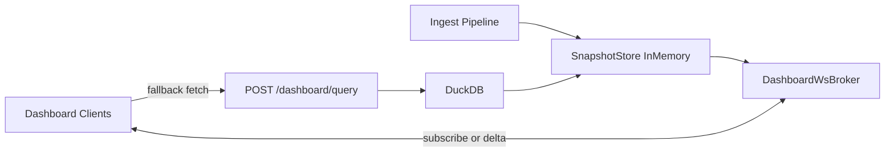

# Dashboard Realtime Snapshot + WebSocket Plan

## Status (repo)

Delivered in phases: **per-project in-memory query snapshot** (`dashboard_query_snapshot_cache`) keeps the default rolling-window `POST /dashboard/query` path cheap by applying ingest deltas between polls; **WebSocket snapshot/delta** remains optional behind `LUMONOX_DASHBOARD_REALTIME_*` / `NEXT_PUBLIC_LUMONOX_DASHBOARD_REALTIME_WS_ENABLED`. Polling-first deployments can disable WS and rely on snapshot + HTTP refresh.

## Goal

Make dashboard updates feel realtime and stable by replacing frequent heavy polling with:

1. in-memory per-project dashboard snapshots on the backend, and
2. WebSocket delta pushes when new events arrive.

This is a phased plan (single-node first), with safe fallback to existing `POST /dashboard/query`.

## Why this change

- Current behavior can trigger canceled frontend requests when DuckDB reads are slow under load.
- Multiple dashboard tabs often request overlapping data, duplicating read work.
- A shared in-memory snapshot can turn repeated expensive reads into incremental updates + fan-out.

## Scope and non-goals

### In scope

- Per-project in-memory snapshot cache on backend.
- Event-driven incremental updates for key dashboard slices.
- WebSocket initial snapshot + delta messages.
- Frontend subscribe/apply-delta flow with graceful fallback.
- Metrics, backpressure, memory limits, and rollout flags.

### Out of scope (initial rollout)

- Multi-region distributed cache consistency.
- Full elimination of `/dashboard/query` (it remains fallback/catch-up path).
- Custom user-defined arbitrary query push streaming.

## Architecture (single-node first)

## Snapshot model (v1)

- **Key:** `project_id`
- **Versioning:** monotonic `snapshot_version` per project
- **Data slices (initial):**
  - overview counters + series (bounded recent window)
  - requests page 1 summary (light route focus)
  - error groups top-N summary
- **Metadata:**
  - `updated_at`
  - `window_policy` (supported windows/buckets)
  - `is_partial` / `degraded_reason` (when some slices lag)

## WebSocket contract (v1)

### Client -> Server

- `dashboard.subscribe` with `project_id`, requested slices, and filters (normalized).
- `dashboard.resume` with last known `snapshot_version`.

### Server -> Client

- `dashboard.snapshot` (full snapshot at subscribe/resync)
- `dashboard.delta` (incremental changes with `from_version`, `to_version`)
- `dashboard.degraded` (temporary fallback hint)

### Delivery rules

- Ordered per project by version.
- If client version gap is too large, server sends full snapshot instead of many deltas.
- If queue pressure is high, coalesce deltas and publish latest.

## Rollout flags

- `LUMONOX_DASHBOARD_REALTIME_ENABLED` (master switch)
- `LUMONOX_DASHBOARD_REALTIME_WS_ENABLED`
- `LUMONOX_DASHBOARD_REALTIME_SNAPSHOT_MAX_PROJECTS`
- `LUMONOX_DASHBOARD_REALTIME_SNAPSHOT_TTL_SECONDS`
- `LUMONOX_DASHBOARD_REALTIME_MAX_DELTA_QUEUE_PER_PROJECT`

## Implementation plan

## Task 1 - Backend snapshot cache foundation

- **Description:** Add `SnapshotStore` (in-memory, per-project, versioned, bounded by TTL + max projects + LRU).
- **Acceptance criteria:**
  - Create/read/update snapshot for a project.
  - Eviction works under memory pressure.
  - Snapshot version strictly increases on update.
- **Inputs:** Existing dashboard slice schemas and metrics module.
- **Outputs:** `SnapshotStore` service + unit tests.
- **Dependencies:** None.
- **Constraints:** No PII expansion beyond existing dashboard response data.
- **Validation:** Unit tests for versioning, eviction, TTL expiry.
- **Rollback:** Feature flag off reverts behavior to current polling.

## Task 2 - Incremental snapshot updater on ingest

- **Description:** Update project snapshot on new events using incremental reducers for selected slices.
- **Acceptance criteria:**
  - Overview/recent slices update without full DuckDB read each event.
  - Drift checker periodically reconciles against canonical query output.
  - Drift beyond threshold triggers full rebuild + metric.
- **Inputs:** Ingest event envelope + current dashboard query helpers.
- **Outputs:** Reducer/update pipeline + reconciliation worker.
- **Dependencies:** Task 1.
- **Constraints:** Must never block ingest hot path.
- **Validation:** Integration tests comparing reducer output vs query output over synthetic streams.
- **Rollback:** Disable reducer path and serve snapshots from periodic rebuild only.

## Task 3 - WebSocket broker and protocol

- **Description:** Add WS broker for project subscriptions and push snapshot/delta messages.
- **Acceptance criteria:**
  - Client receives full snapshot on subscribe.
  - Client receives ordered deltas with version continuity.
  - Coalescing/backpressure prevents unbounded queues.
- **Inputs:** Existing dashboard WS path/hooks.
- **Outputs:** Broker, protocol types, heartbeat/reconnect handling.
- **Dependencies:** Tasks 1-2.
- **Constraints:** Per-project authorization enforced for subscriptions.
- **Validation:** Multi-client integration test (N clients same project) with monotonic version checks.
- **Rollback:** Keep WS disabled and continue polling-only FE.

## Task 4 - Frontend realtime state application

- **Description:** Prefer WS snapshot/delta stream for live dashboard updates; retain fetch fallback.
- **Acceptance criteria:**
  - Dashboard renders from snapshot, applies deltas without flicker.
  - On version gap/disconnect, FE performs one catch-up fetch then resumes WS.
  - Cancelled polling requests materially decrease vs baseline.
- **Inputs:** Existing `DashboardDataContext` and fetch lifecycle.
- **Outputs:** FE realtime adapter + reconciliation fallback.
- **Dependencies:** Task 3.
- **Constraints:** Preserve existing route/filter semantics.
- **Validation:** E2E for open dashboard, event ingest, and live UI update.
- **Rollback:** FE config switch back to polling-first.

## Task 5 - Observability, SLOs, and ops runbook

- **Description:** Add metrics/logging and operational guidance for realtime mode.
- **Acceptance criteria:**
  - Metrics: ws connected clients, publish latency, dropped/coalesced deltas, snapshot rebuilds, drift repairs.
  - SLO dashboards include p95 time-to-visual-update and cancel-rate trend.
  - Runbook documents tuning knobs and failure modes.
- **Inputs:** Service metrics endpoint and docs.
- **Outputs:** Metrics, alerts, runbook section.
- **Dependencies:** Tasks 1-4.
- **Constraints:** Logging must avoid sensitive payload data.
- **Validation:** Manual incident drill (disconnects, high event rate, memory pressure).
- **Rollback:** Disable realtime flags, verify polling path remains healthy.

## Multi-node follow-up (Phase 2)

After single-node stability:

- Add pub/sub (Redis or equivalent) to broadcast project delta events across instances.
- Keep local snapshot store per instance, fed from shared change stream.
- Include idempotent version stamps to avoid duplicate apply.

## Success metrics

- >= 80% drop in frontend canceled dashboard requests.
- p95 initial dashboard usable paint improved or unchanged.
- p95 incremental update-to-render latency <= 500ms in steady state.
- No increase in ingest p95 latency.
- No sustained memory growth from snapshot cache (bounded + eviction working).

## Risks and mitigations

- **Risk:** Snapshot drift from reducer bugs.
  - **Mitigation:** periodic reconcile + drift metric + auto full rebuild.
- **Risk:** Memory pressure with many active projects.
  - **Mitigation:** strict TTL/LRU caps + project activity thresholds.
- **Risk:** WS fan-out burst overload.
  - **Mitigation:** per-project queue caps + delta coalescing + degraded mode.
- **Risk:** Auth leakage across projects.
  - **Mitigation:** enforce project-scoped auth on subscribe and every publish path.

## Suggested execution order

1. Task 1
2. Task 2
3. Task 3
4. Task 4
5. Task 5
6. Phase 2 (multi-node)

## Junior engineer checklist

1. Implement `SnapshotStore` with tests before touching WS.
2. Add reducer for one slice (`overview`) first, verify parity.
3. Add WS `snapshot` message only, then add `delta`.
4. Keep `/dashboard/query` fallback intact throughout.
5. Add metrics before load testing.
6. Run E2E core journey and a manual live-update scenario before enabling by default.
