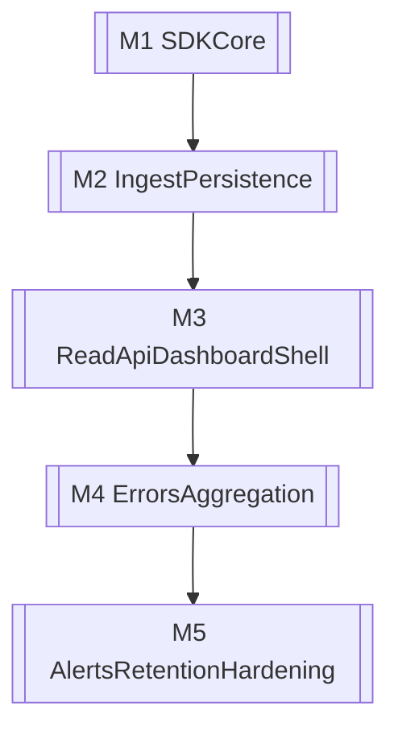

# AutoPulse Detailed Development Process

This document defines how we execute MVP delivery work in this repository.

Precedence rule:

- `DEVELOPMENT.md` remains the product and engineering source of truth.
- This document is an execution guide (phases, tasks, acceptance checks, and verification flow).
- If any wording here conflicts with `DEVELOPMENT.md`, follow `DEVELOPMENT.md`.

## 1) Operating Principles

- Keep scope inside the MVP promise: answer what broke, when, and which requests led to it.
- Do not add features that force users to think like observability engineers.
- Protect the host application first: SDK code must stay async, non-blocking, and bounded.
- Keep ingestion fast and push expensive work to background processing as the system grows.
- Use conservative data capture defaults and scrub sensitive fields before transmission.
- Store API keys hashed (never plaintext), and treat auth/scrubbing behavior as release gates.

## 2) Development Environment and Quality Gates

Run from repository root:

```bash
uv sync --group dev
uv run ruff check .
uv run ruff format --check .
uv run mypy
uv run bandit -c pyproject.toml -r sdk/src/autopulse -r backend/src/autopulse_backend
uv run pytest
```

Optional local setup:

```bash
uv run pre-commit install
```

Execution policy:

- Run targeted tests during implementation (`uv run pytest sdk/tests/...`) for speed.
- Run full root checks before merge.
- For security-sensitive changes, always include Bandit and a manual scrub/auth review.

## 3) Default Per-Task Workflow (Cross-Cutting)

Use this workflow for every feature/fix, aligned with `agents/implement-task.md`:

1. Understand and restate request, assumptions, and touchpoints.
2. Analyze package boundaries, hot-path risk, trust-boundary crossings, and test plan.
3. Sketch smallest viable design and rollback path.
4. Implement in one vertical slice where possible.
5. Verify with targeted tests and full static checks.
6. Prepare handoff with clear risk notes and verification evidence.
7. Present a concise user update covering all changed files and the main points before finalizing.
8. Commit only after implementation is complete and verification checks pass.

When to use specialized playbooks:

- Security/privacy-sensitive work: `agents/security-privacy.md`
- Dashboard/onboarding/user-facing workflows: `agents/ui-ux-analysis.md`
- Pre-merge and regression review: `agents/review.md`

## 4) MVP Macro Delivery Plan (Build Order 1-16)

Milestone mapping from `DEVELOPMENT.md` build order:

- **M1 - SDK core foundation:** steps 1-5 (completed)
- **M2 - Ingest and persistence:** steps 6-8 (completed)
- **M3 - Read API and dashboard shell:** steps 9-11
- **M4 - Errors and aggregation intelligence:** steps 12-13
- **M5 - Alerts, retention, and hardening:** steps 14-16

Milestone dependency diagram:



Delivery note:

- The first shippable loop is install SDK, send requests, and view recent requests/errors.
- Aggregation sophistication and alert quality can iterate after this loop is stable.

## 5) Milestone Playbook Templates (Goals, Tasks, Acceptance, Tests, Verification)

Use the structure below for each milestone. Keep each checklist tied to explicit build-order steps.

### M1 - SDK core foundation (Build Order 1-5)

**Status**

- Completed.

**Goal**

- One-line FastAPI integration captures request/error events without impacting host app reliability.

**Tasks**

- Create SDK package skeleton and init surface.
- Implement FastAPI middleware timing and request lifecycle hooks.
- Capture request/error event payloads with route normalization where possible.
- Add bounded in-memory queue with explicit drop-on-full strategy.
- Add background batch sender with size/time flush triggers and bounded retries.

**Acceptance criteria**

- SDK integration path is minimal and clear.
- Middleware captures exception details and re-raises original exceptions.
- Queue and sender remain bounded and non-blocking on the hot path.
- Transient send failures do not break observed applications.
- Sensitive-key scrubbing defaults apply before send.

**Tests**

- `sdk/tests`: unit tests for event capture and schema shape.
- `sdk/tests`: queue bound behavior and drop-path behavior.
- `sdk/tests`: batch flush by size and by interval.
- `sdk/tests`: retry exhaustion behavior and silent failure default.
- `sdk/tests`: sensitive field scrub coverage.

**Verification**

```bash
uv run pytest sdk/tests
uv run ruff check .
uv run mypy
```

---

### M2 - Ingest and persistence (Build Order 6-8)

**Status**

- Completed.

**Goal**

- Authenticated batch ingest accepts valid events and stores normalized raw data.

**Tasks**

- Implement `POST /ingest` contract with batch body validation.
- Add API key authentication and project resolution.
- Attach ingest metadata (`project_id`, receive timestamp, SDK version).
- Persist raw events in Postgres using the MVP schema and indexes.
- Keep request path fast and avoid expensive inline processing.

**Acceptance criteria**

- Unauthorized/invalid keys are rejected.
- Valid batches return accepted-count response.
- Raw events persist with normalized timestamps and server metadata.
- API key storage remains hashed-only.

**Tests**

- `backend/tests`: auth rejection/acceptance matrix.
- `backend/tests`: payload validation and partial-failure behavior.
- `backend/tests`: metadata attachment and persistence assertions.
- Contract tests for `POST /ingest` response shape and status codes.
- Migration tests for initial tables/indexes.

**Verification**

```bash
uv run pytest
uv run ruff check .
uv run mypy
uv run bandit -c pyproject.toml -r sdk/src/autopulse -r backend/src/autopulse_backend
```

**Operational run modes (M5)**

- One-off alert evaluation (cron/external scheduler): `uv run python -m autopulse_backend.jobs alerts-once`
- One-off retention cleanup (cron/external scheduler): `uv run python -m autopulse_backend.jobs retention-once`
- Optional local/dev in-process scheduler: set `JOBS_ENABLE_SCHEDULER=true` and tune intervals with
  `JOBS_ALERT_INTERVAL_SECONDS` and `JOBS_RETENTION_INTERVAL_SECONDS`.
- SDK benchmark command: `uv run pytest sdk/tests/test_benchmarks.py`

---

### M3 - Read API and dashboard shell (Build Order 9-11)

**Goal**

- Developers can see overview trends and recent requests quickly after integration.

**Tasks**

- Implement minimal dashboard API for overview/request data reads.
- Build overview page with request rate, error rate, and average latency.
- Build recent request list with core columns and basic filters.
- Ensure empty/loading/error states communicate setup and system health clearly.

**Acceptance criteria**

- API provides stable payloads for overview and request table.
- Dashboard renders required overview signals and request table columns.
- New users can confirm event flow quickly after first instrumented traffic.

**Tests**

- `backend/tests` (future): response schema and authz checks for read endpoints.
- `frontend` tests (future framework choice): render tests for overview and request table states.
- Manual UI checks: install SDK, generate traffic, verify first dashboard visibility window.

**Verification**

```bash
uv run pytest
uv run ruff check .
uv run mypy
```

---

### M4 - Errors and aggregation intelligence (Build Order 12-13)

**Goal**

- Error groups and per-minute aggregation make root-cause discovery fast.

**Tasks**

- Add grouped error view with count, first/last seen, route context, and sample stack trace.
- Implement basic per-minute metric aggregation for overview charts.
- Implement stable error grouping hash strategy for practical de-duplication.
- Add indexes and query paths needed for responsive grouped-error and trend reads.

**Acceptance criteria**

- Similar failures are grouped predictably enough for triage.
- Per-minute metrics correctly feed request/error/latency overview read paths.
- Grouped errors page highlights top/current failures with clear timestamps.

**Tests**

- `backend/tests`: grouping behavior across equivalent stack traces.
- `backend/tests`: per-minute aggregation correctness (counts and latency aggregates).
- `backend/tests`: query/index assumptions for common dashboard reads.
- Manual checks: induced repeated error appears as one group with incrementing counts.

**Verification**

```bash
uv run pytest
uv run ruff check .
uv run mypy
```

---

### M5 - Alerts, retention, and hardening (Build Order 14-16)

**Goal**

- MVP reaches operational readiness with basic alerting, cleanup, and SDK performance confidence.

**Tasks**

- Implement email alerts for error spikes and simple outage heuristics.
- Add retention cleanup for raw events and longer-lived aggregates.
- Add SDK benchmarks and document expected overhead envelope.
- Validate fail-silent behavior under backend outages and degraded network conditions.

**Acceptance criteria**

- Alert triggers and suppression behavior are understandable and predictable.
- Retention cleanup runs safely and preserves expected data windows.
- Benchmark evidence shows acceptable SDK overhead in common-path usage.
- SDK outage/failure behavior remains non-disruptive to host applications.

**Tests**

- `backend/tests`: alert threshold and heuristic trigger coverage.
- `backend/tests`: retention job data-deletion boundaries and safety checks.
- `sdk/tests`: benchmark harness smoke tests and regression thresholds.
- Manual checks: simulated ingest outage does not break host app request serving.

**Verification**

```bash
uv run pytest
uv run ruff check .
uv run mypy
uv run bandit -c pyproject.toml -r sdk/src/autopulse -r backend/src/autopulse_backend
```

## 6) Test Strategy by Repository Phase

Current repository state:

- Active test packages: `sdk/tests`, `backend/tests`, and `frontend` Vitest suites.
- `frontend/` is an active Next.js dashboard application with overview/logs/diagnosis/alerts routes.

Scaling strategy:

- Keep SDK behavioral tests in `sdk/tests` from day one.
- Continue expanding `backend/tests` alongside ingest/read API growth.
- Keep frontend unit/smoke tests in `frontend/` and expand coverage as dashboard UX grows.
- Preserve root-level CI as the global gate while allowing local targeted loops.

Test taxonomy used across milestones:

- Unit tests: event construction, hashing, scrub functions, queue/sender internals.
- Integration/API tests: ingest auth, persistence, aggregation reads.
- UI tests: overview/request/error rendering, empty/error/loading states.
- Manual scenario tests: end-to-end first-value path and outage resilience.

## 7) MVP Completion Gate (Must Match DEVELOPMENT.md)

Treat MVP completion as a release gate, not a status note.
All checks below must pass in one verification cycle and include evidence links
(test output, screenshots, command snippets, or notes in the release PR description).

### 7.1 Required gate checks

- **One-line integration:** verify a clean FastAPI sample app can enable AutoPulse with one line and no extra observability configuration.
- **First value speed:** after generating traffic, requests are visible in the dashboard within a few seconds.
- **Error diagnosis:** induced exceptions are grouped and visible with stack traces.
- **Core overview signals:** request rate, error rate, and average latency are visible and numerically plausible.
- **Fail-silent SDK behavior:** when backend is unavailable, the host app still serves requests successfully.
- **Default scrubbing:** sensitive headers and common secret fields are scrubbed in captured payloads.
- **Alert baseline:** simple error spike emits an email alert.
- **Outage heuristic:** simple outage pattern emits an email alert.
- **Setup brevity:** onboarding/setup docs are concise enough for a new user to read in a few minutes.

### 7.2 MVP gate execution checklist

Run these checks in order from repository root:

```bash
uv sync --group dev
uv run pytest
uv run ruff check .
uv run ruff format --check .
uv run mypy
uv run bandit -c pyproject.toml -r sdk/src/autopulse -r backend/src/autopulse_backend
npm --prefix frontend install
npm --prefix frontend run lint
npm --prefix frontend run typecheck
npm --prefix frontend run test
```

Then perform the manual MVP scenario:

1. Start backend and frontend locally.
2. Integrate SDK into a minimal FastAPI app (one-line middleware enablement).
3. Generate normal and failing traffic.
4. Capture evidence for first-value time, grouped errors, and overview metrics.
5. Simulate backend outage and verify host app continuity.
6. Validate scrubbed payload output and alert dispatch behavior.

### 7.3 MVP sign-off requirement

MVP is complete only when all checks in `7.1` are marked pass and all evidence from `7.2`
is attached to the milestone release PR.
Any failed check blocks MVP declaration until remediated.

## 8) Risk and Release Readiness Checks

Before each milestone release, run a structured risk review using the classes below.
Every class needs: current status (`pass`, `needs mitigation`, or `blocked`), evidence,
and an explicit owner when mitigation is required.

### 8.1 Required risk classes

- **SDK hot path performance risk:** latency regression in middleware/request path.
- **Reliability containment risk:** unbounded memory growth or retry storms during outages.
- **Data exposure risk:** sensitive leakage from header/body/query capture.
- **Auth boundary risk:** API-key/auth drift (hashed keys, project isolation, reject invalid credentials).
- **Transport/default security drift:** production HTTPS and conservative capture defaults.
- **Product scope drift:** dashboard complexity moving away from fast diagnosis.
- **Data lifecycle risk:** storage growth and retention-policy correctness.

### 8.2 Per-release readiness routine

For each milestone release:

1. Run full automated checks from section `7.2`.
2. Complete a manual risk walk for all classes in `8.1`.
3. Record mitigations, owners, and due dates for non-pass classes.
4. Confirm no unresolved `blocked` risks remain for MVP-critical behavior.
5. Add a short "release readiness" note to the PR describing residual risk.

### 8.3 Release decision rule

Release proceeds when:

- all automated checks pass,
- no `blocked` risks remain in the classes above,
- any `needs mitigation` risks have an owner and dated follow-up issue,
- and the release note includes residual-risk acknowledgment.

Keep mitigations aligned with `DEVELOPMENT.md` engineering-risk guidance.

## 9) Post-MVP and Deferred Work

Tracked but intentionally deferred from MVP completion:

- Background jobs and cron monitoring depth improvements.
- Smarter sampling and richer route/status/error filtering.
- Slack/Discord notifications.
- Local sidecar agent exploration.
- WebSocket-driven live dashboard updates.
- Any distributed tracing, custom dashboard builders, or complex alert-rule systems.

These are evaluated after MVP validation, not during MVP delivery.
