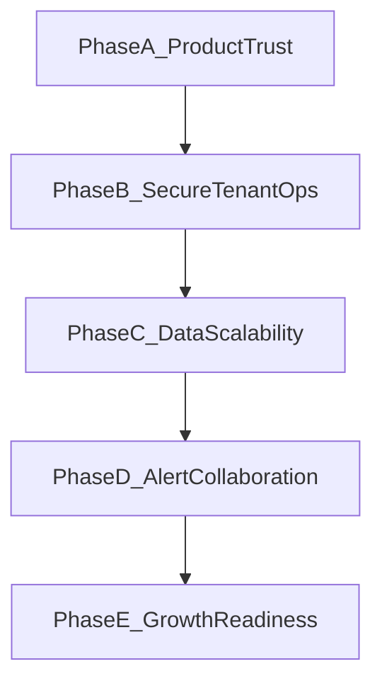

# AutoPulse Full Gap Analysis and Next-Phase Roadmap

## Purpose

This document turns the current plan into an executable product and engineering roadmap. It is grounded in current implementation state across `sdk/`, `backend/`, and `frontend/` and aligned with the diagnosis-first MVP rule in `DEVELOPMENT.md`.

## 1) Capability Inventory by Domain

### SDK (`sdk/`)

Current strengths:
- FastAPI/Starlette middleware capture with request + error events in `sdk/src/autopulse/_monitor.py`.
- Bounded non-blocking queue (`asyncio.Queue(maxsize=...)`) with drop-on-full behavior.
- Background batch sender with flush-by-size and flush-by-time.
- Retry with bounded attempts and exponential backoff.
- Silent-failure default behavior; optional debug logs.
- Sensitive-field scrubbing with default redact keys aligned to `DEVELOPMENT.md`.
- Embedded mode support in `sdk/src/autopulse/_embedded.py`.

Current limitations:
- Default capture posture keeps headers and query strings off unless opted in (`capture_headers` / `capture_query_params` default to false via env in `sdk/src/autopulse/_monitor.py`).
- Retry path treats all failures as retryable (including likely permanent 4xx classes).
- No built-in SDK diagnostics surface for queue drop rate and sender health.

### Ingest + Data Path (`backend/src/autopulse_backend/routes/ingest.py` and services)

Current strengths:
- Authenticated `POST /ingest` with API key validation and project scoping.
- Payload size rejection (`413`) and ingest rate limiting (`429` with `Retry-After`).
- Optional HTTPS enforcement and forwarded-proto handling.
- Async aggregate worker path with sync fallback when queue enqueue fails.
- Metrics instrumentation for accepted/rejected ingest flow.

Current limitations:
- In-process aggregate queue is not durable across process crashes/restarts.
- Broad fail-open exception handling may hide sustained degradation modes.
- Distributed rate-limit fallback behavior prioritizes availability over strict enforcement visibility.

### Dashboard + Query UX APIs

Current strengths:
- Overview, requests, diagnosis, error groups, alert settings/dispatches, retention settings, theme settings are implemented and consumed by frontend.
- Route-scoped query state and persisted filter state in `frontend/components/dashboard/DashboardDataContext.tsx`.
- Real-time refresh via WebSocket updates channel.
- SQL filter validation flow exists for logs query surfaces.

Current limitations:
- Diagnosis is still distributed across multiple pages rather than one canonical incident workspace.
- Some insight surfaces depend on loaded slices rather than explicit full-window ranked incident data.
- Filter semantics are split between server scope and client-local transformations, increasing cognitive load.

### Auth + Tenancy + Governance

Current strengths:
- Magic-link dashboard auth, cookie sessions, session introspection/logout.
- Bootstrap tenant creation path.
- Organization membership (owner/member), invitation, and role update endpoints.
- API key issuance, rotation, revocation.
- Governance audit event writes for key/member lifecycle operations.

Current limitations:
- Browser-side naming and some semantics still reflect legacy API-key assumptions.
- Project lifecycle beyond bootstrap is not yet a complete self-serve admin experience.
- Optional dashboard API-key fallback exists in config surface and can weaken session-first posture if enabled broadly.

### Alerts + Retention + Operations

Current strengths:
- Alert evaluator with error-spike and outage heuristics.
- Dispatch history model includes delivery status, reason code, attempt count, provider IDs.
- Sender abstraction includes email/webhook/slack/discord transport paths.
- Retention cleanup and optional archival support.
- Health/readiness/internal metrics and scheduler lease support.

Current limitations:
- Alert channel UX in settings still exposes "planned" channels as scaffolding.
- Operational SLO targets are not codified as explicit release gates in one canonical implementation checklist.
- Background job observability can improve (lag, queue pressure, richer failure diagnostics).

### Billing and Entitlements

Current strengths:
- Retention plan concepts exist in project settings.

Current limitations:
- No complete billing/subscription/entitlement enforcement loop yet.
- No plan-based feature enforcement gate for settings and resource usage controls.

## 2) Missing Features Matrix (Prioritized)

### P0: Must Close Next (product trust + launch confidence)

1. Session-first dashboard auth hardening end-to-end (remove residual API-key semantics in browser UX and defaults).
2. Self-serve onboarding completion (first login -> project setup -> first ingest -> first diagnosis signal) with minimal operator intervention.
3. Alert reliability UX completion (active channel verification, delivery diagnostics, failure reason guidance).
4. Ingest/backpressure SLO definitions and telemetry surfaces (413/429 trends, aggregate queue pressure, fallback frequency).
5. Documentation alignment pass so shipped behavior and "planned" language no longer conflict.

### P1: Scale and Reliability

1. Scalable cursor pagination and query consistency across requests/error-groups/diagnosis drill-down.
2. Durable and observable aggregation pipeline for sustained load.
3. Background job operability improvements (lag, failure visibility, actionable health diagnostics).
4. Retention + archival policy hardening with clear guardrails and server-side enforcement hooks.

### P2: Growth and Team Workflows

1. Multi-project organization lifecycle polish (team operations beyond bootstrap).
2. Productionized Slack/Discord channel management as first-class alert destinations.
3. Guided investigation improvements that reduce page hopping and increase culprit-first ranking clarity.
4. Billing/entitlement readiness: plan-aware limits and feature controls (without adding enterprise complexity).

## 3) Phased Roadmap (A-E) with Dependencies and Acceptance Goals

### Phase A (2-4 weeks): Product-Trust Hardening

Primary outcomes:
- Session-first dashboard access is the default user path.
- First-value onboarding is deterministic and measurable.
- Docs and product copy align with real behavior.

Acceptance goals:
- No browser-exposed long-lived ingest/dashboard secret in default flow.
- New user reaches first diagnostic signal in a short guided path.
- Settings and alerts pages do not present inactive channels as active behavior.

Implementation tasks with AC and tests:
1. Session-first auth contract hardening
   - AC: Dashboard UI and API flows are session-gated by default; API-key fallback remains explicit opt-in only.
   - Tests: backend auth contract (session required/expired); frontend route-guard and sign-in UX regressions.
2. Deterministic onboarding checkpoints
   - AC: onboarding state is backend-driven (`session -> project -> ingest key -> first event -> diagnosis signal`) and resumable.
   - Tests: onboarding status endpoint integration tests; frontend onboarding state rendering tests; happy-path E2E.
3. Alert/settings capability truthfulness
   - AC: only active channels are shown as active; planned channels are marked planned/unavailable, never implied live.
   - Tests: backend capability endpoint contract test; frontend capability rendering and disabled-channel interaction tests.
4. Alert dispatch diagnostics clarity
   - AC: dispatch list provides human-readable failure reason in addition to reason code.
   - Tests: serializer/route tests for reason mapping; frontend dispatch table rendering tests.
5. Docs and copy alignment pass
   - AC: docs and in-product copy match real behavior for auth flow and channel support.
   - Tests: manual docs QA checklist + smoke navigation through onboarding/settings/alerts copy.

### Phase B (4-8 weeks): Secure Multi-Tenant Operations

Primary outcomes:
- Day-2 operations for owners/members/projects are stable and self-serve.
- Governance and role enforcement are predictable.

Acceptance goals:
- Owner/member workflows pass backend + frontend contract tests.
- API key lifecycle operations remain auditable and interruption-safe.
- Project lifecycle operations are explicit and consistent across API/UI.

### Phase C (6-10 weeks): Data Path Scalability

Primary outcomes:
- Diagnosis surfaces stay fast and reliable at higher event volume.
- Aggregation and query paths are resilient under load.

Acceptance goals:
- Overview/diagnosis/read APIs hit defined latency targets at expected traffic.
- Aggregate pipeline degradation is visible before user-facing regressions.
- Cursor-based navigation supports stable large-window investigations.

### Phase D (4-6 weeks): Alerts and Collaboration

Primary outcomes:
- Alert delivery is trusted and diagnosable by users.
- Team communication channels are operationalized where configured.

Acceptance goals:
- Dispatch timeline includes actionable failure reason clarity.
- Active channels provide clear verification status and retry behavior.
- Alert tuning controls reduce noise without requiring complex rule builders.

### Phase E (ongoing): Growth Readiness

Primary outcomes:
- Plan-aware retention and governance controls are enforceable.
- Team workflows scale without sacrificing default simplicity.

Acceptance goals:
- Retention/archival behavior is predictably enforced by plan constraints.
- Organization-level workflows and invite/role governance remain low-friction.
- Growth features do not violate diagnosis-first/no-observability-engineering guardrails.

## 4) Execution Model and Release Governance

### Vertical slice delivery model

Each roadmap item ships as a full slice:
- Backend API and persistence updates.
- Frontend UX and state model updates.
- Tests (unit + integration + contract where applicable).
- Docs/runbook updates.
- Operational metrics and release checks.

### Release gates by change type

Auth/tenant changes:
- Session and authorization contract tests pass.
- No public-secret regression in frontend/runtime configuration.

Ingest/data-path changes:
- Payload/rate-limit behavior preserved (`413`/`429` semantics).
- Aggregate pipeline fallback and failure telemetry validated.
- Query latency and error budgets measured before rollout.

Alerts changes:
- Dispatch status/reason coverage verified.
- Provider failure paths tested with deterministic expected outcomes.
- UI presents actionable diagnostics for operators and end users.

### Quarterly roadmap governance

- Re-rank P0/P1/P2 priorities quarterly using real activation and incident signals.
- Keep roadmap scope bounded by `DEVELOPMENT.md` guardrails.
- Reject additions that force users into observability-engineering workflows.

## 5) Recommended Immediate Work Queue (Next 30 Days)

1. Rename/realign frontend auth session semantics and remove residual API-key-first cues.
2. Implement onboarding completion analytics and explicit first-value checkpoints.
3. Replace planned-channel scaffolding UX with feature-availability states tied to backend config.
4. Add ingest/aggregate reliability dashboard metrics and operator alerts.
5. Publish a single source rollout checklist covering auth, ingest, alerts, and retention.
