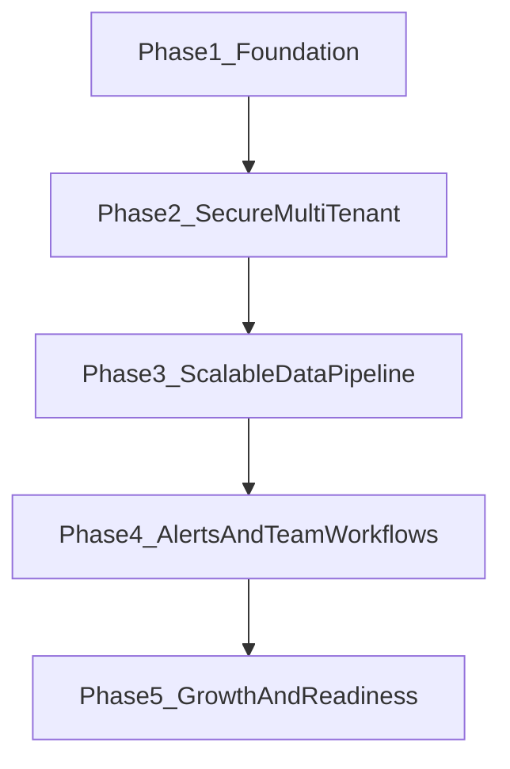

# Post-MVP Product Roadmap (Real App)

## Purpose

This document defines the next development steps to evolve AutoPulse from MVP into a production-ready app for small teams, while preserving the core product promise: fast diagnosis with low configuration.

## Product Guardrails

- Keep diagnosis-first UX: users should understand what broke within seconds.
- Avoid observability-engineering complexity in default workflows.
- Maintain SDK safety properties: non-blocking, bounded memory, silent failure by default.
- Keep ingestion fast and predictable; move heavy work out of request path as scale grows.
- Preserve privacy-first defaults (sensitive data scrubbing and conservative capture).

## Current State Baseline (MVP Snapshot)

AutoPulse already has a usable end-to-end MVP loop:

- SDK middleware captures request and error events and sends batches asynchronously.
- Backend `POST /ingest` accepts authenticated batches and stores raw events.
- Dashboard APIs provide overview metrics, requests, and grouped errors.
- Frontend shows overview/diagnosis/log views and renders core request and error context.
- Alert evaluation and retention jobs exist, but delivery and operational hardening are not complete.

### Known Post-MVP Gaps

- Multi-tenant lifecycle is incomplete (project/workspace provisioning, user roles, key lifecycle UX).
- Frontend currently relies on a browser-visible API key model that must be replaced for production.
- Metrics and error grouping are mostly computed from raw events at read time, which will not scale.
- Alert delivery is heuristic-first and needs production integrations and delivery observability.
- Reliability/operations are missing production maturity (health/readiness, stronger job failure visibility, hardened ingest controls).

## What "Real App" Means

AutoPulse qualifies as a real app when all of the following are true:

- Teams can onboard, manage projects, and rotate/revoke credentials without manual DB steps.
- Dashboard access uses secure user authentication and scoped authorization.
- Ingestion handles growth safely with clear limits, backpressure behavior, and measurable SLOs.
- Core dashboards remain fast at higher data volumes via pre-aggregation and scalable query patterns.
- Alerts are reliably delivered through real channels with auditable dispatch history.
- Operational posture supports continuous delivery with confidence (tests, runbooks, health checks, release gates).

## Feature Catalog (Post-MVP)

Priority tiers:

- **Tier 1**: Must-have next (foundation for production).
- **Tier 2**: Scale-up (performance, reliability, and operability).
- **Tier 3**: Growth (team workflows and ecosystem expansion).

Ownership tags:

- `BE` backend-only
- `FE` frontend-only
- `BE+FE` cross-stack

### Tier 1 - Must-Have Next

1) Identity, tenancy, and credentials (`BE+FE`)
- `BE`: Project/workspace provisioning APIs, API key issuance/rotation/revocation, role model (owner/member).
- `FE`: Onboarding flow for project creation and key management, role-aware settings UI.
- Outcome: secure, repeatable customer onboarding without manual operator intervention.

2) Secure dashboard access model (`BE+FE`)
- `BE`: Session/JWT auth for dashboard users, scoped read permissions, audit events for auth actions.
- `FE`: Remove public API key pattern; use authenticated server-side or token-based session flow.
- Outcome: production-safe access model and reduced credential leakage risk.

3) Alerting foundation with real delivery (`BE+FE`)
- `BE`: Provider-backed email sender, retry policy, dispatch status tracking, alert settings API.
- `FE`: Alert settings UI, destination verification/status, alert history timeline.
- Outcome: actionable and trusted notifications.

4) Core operational controls (`BE`)
- Health/readiness endpoints, ingest size/rate limits, explicit error semantics for overload.
- Structured logs and basic internal service metrics for API/job health.
- Outcome: stable operations and predictable failure modes.

5) Quality gates expansion (`BE+FE`)
- API contract tests for dashboard and auth flows.
- Frontend rendering and interaction tests for dashboard and alert settings.
- Outcome: safe iteration speed and lower regression risk.

### Tier 2 - Scale-Up

1) Pre-aggregated metrics pipeline (`BE`)
- Introduce minute/hour metric buckets and incremental aggregation workers.
- Keep raw events for drill-down and forensic diagnosis.
- Outcome: consistent dashboard latency as traffic grows.

2) Error grouping durability and query optimization (`BE`)
- Persist grouping metadata and grouping history rather than deriving all groups on each read.
- Optimize index strategy and hot queries used by diagnosis views.
- Outcome: accurate, stable error group insights at scale.

3) High-volume request/log UX (`FE+BE`)
- `BE`: Cursor pagination and server-side filters for high-cardinality dimensions.
- `FE`: Efficient table virtualization and async filter states for large datasets.
- Outcome: responsive investigation workflows under load.

4) Job-system reliability hardening (`BE`)
- Stronger failure visibility (alerts/metrics/logs) for periodic jobs.
- Idempotent job execution patterns and operational runbook support.
- Outcome: background systems become observable and recoverable.

5) Data lifecycle tiers (`BE+FE`)
- `BE`: Multi-tier retention controls and archival strategy.
- `FE`: Plan-aware retention and storage controls in settings.
- Outcome: controlled storage cost and clearer customer value segmentation.

### Tier 3 - Growth

1) Team and organization workflows (`BE+FE`)
- Multi-project organization views, role management, and invite flows.
- Outcome: broader adoption inside small engineering teams.

2) Channel expansion for alerts (`BE+FE`)
- Slack/Discord integrations and channel routing UX.
- Outcome: reduced time-to-awareness for incidents.

3) Developer productivity surfaces (`FE`)
- In-app runbooks and guided diagnosis paths tied to common failures.
- Outcome: faster onboarding and reduced support burden.

4) Ingestion evolution options (`BE`)
- Optional sidecar agent path for advanced routing/reliability needs.
- Keep direct SDK ingest path as default for simplicity.
- Outcome: extensibility without complicating default user setup.

## Dependency Map

Cross-phase dependency notes:

- Phase 2 depends on Phase 1 auth and project primitives.
- Phase 3 depends on secure access and stable ingest limits from Phases 1-2.
- Phase 4 depends on scalable data/API paths from Phase 3.
- Phase 5 depends on mature reliability and team foundations from Phases 2-4.

## Phased Execution Plan

## Phase 1 - Foundation Hardening (4-6 weeks)

Focus:
- Production safety baseline and secure access prerequisites.

Key work:
- `BE`: health/readiness endpoints, ingest request-size limits, rate limiting strategy, structured internal service metrics.
- `BE`: dashboard user auth primitives and permission model scaffolding.
- `FE`: remove direct browser secret dependency and route dashboard data through authenticated access path.
- `BE+FE`: alert settings contract baseline (read/write API + starter UI states).

Entry criteria:
- MVP loop is stable in staging.

Exit criteria:
- No browser-exposed long-lived ingest/dashboard key.
- Health/readiness endpoints integrated in deployment checks.
- Basic auth flow protects dashboard reads.

Acceptance checklist:
- [ ] Dashboard access requires authenticated user session.
- [ ] Ingest rejects oversized payloads with explicit response semantics.
- [ ] Service health is externally probeable.
- [ ] Alert settings can be viewed and updated end-to-end.

## Phase 2 - Secure Multi-Tenant Operations (4-8 weeks)

Focus:
- Complete tenant lifecycle and administrative workflows.

Key work:
- `BE`: APIs for project creation, key rotation/revocation, role assignment.
- `FE`: onboarding wizard (workspace/project creation, key copy/rotation flows).
- `BE`: audit trail for credential and role changes.
- `FE`: role-aware settings and guardrails for destructive actions.

Entry criteria:
- Phase 1 auth and access controls are live.

Exit criteria:
- New tenant onboarding is self-serve.
- Credential lifecycle is managed in-product.

Acceptance checklist:
- [ ] Owner can create project and issue scoped key.
- [ ] Key rotation does not break ingest continuity.
- [ ] Revoked key is denied immediately by backend auth checks.
- [ ] Role-based UI restrictions match backend authorization policy.

## Phase 3 - Scalable Data Pipeline (6-10 weeks)

Focus:
- Keep diagnosis fast with growing event volume.

Key work:
- `BE`: pre-aggregated metric buckets and background aggregation jobs.
- `BE`: persisted error-group metadata and optimized query/index strategy.
- `BE`: cursor-based pagination and stronger filter APIs for large result sets.
- `FE`: migrate dashboard tables/charts to scalable query model and high-volume UX.

Entry criteria:
- Phase 2 tenancy/security model is stable in production-like traffic.

Exit criteria:
- Overview and diagnosis pages remain performant at target traffic.

Acceptance checklist:
- [ ] Overview API latency SLO is met at expected production load.
- [ ] Error-group query latency remains stable after dataset growth.
- [ ] Logs/requests pages support stable cursor navigation.
- [ ] Drill-down from aggregates to raw events remains intact.

## Phase 4 - Alerts and Team Workflows (4-6 weeks)

Focus:
- Trustworthy notifications and collaborative response.

Key work:
- `BE`: production email provider integration with retries and delivery states.
- `BE`: alert dispatch history APIs and failure-reason model.
- `FE`: alerts history, delivery status, and tuning controls.
- `BE+FE`: optional Slack/Discord channel delivery (initial version).

Entry criteria:
- Phase 3 data/latency baseline is stable.

Exit criteria:
- Customers can configure and trust alert delivery in at least one channel.

Acceptance checklist:
- [ ] Alert sends are observable with status and timestamp.
- [ ] Delivery failures surface actionable reason codes.
- [ ] Users can tune thresholds/cooldowns in UI.
- [ ] At least one external channel beyond in-app views is production-ready.

## Phase 5 - Growth and Release Readiness (ongoing)

Focus:
- Reliability, compliance posture, and sustainable product growth.

Key work:
- `BE+FE`: retention tiering and archival controls.
- `BE+FE`: organization-level views and role governance improvements.
- `BE`: runbook-driven operations, stronger deploy gates, and failure drills.
- `FE`: guided troubleshooting/runbook surfaces for frequent incident patterns.

Entry criteria:
- Phases 1-4 outcomes are achieved and monitored.

Exit criteria:
- Product can scale customer count and traffic with predictable ops effort.

Acceptance checklist:
- [ ] Retention and archival controls are configurable and enforced.
- [ ] Operational runbooks are validated through rehearsed incident drills.
- [ ] Release checklist covers auth, ingest, alerts, and data integrity gates.
- [ ] Product analytics show improved activation and diagnosis success outcomes.

## Release Gates and Quality Strategy

Each phase ships behind explicit readiness checks:

1) **Technical gates**
- API contract tests pass for changed surfaces.
- Relevant load/performance checks pass for ingest and dashboard reads.
- Security checks for auth/key handling pass before release.

2) **Product gates**
- First-value and diagnosis workflows remain within target time.
- No mandatory “advanced observability” configuration added to default path.

3) **Operational gates**
- Rollout plan, rollback plan, and runbook updates are prepared.
- On-call visibility for new jobs/endpoints is in place before rollout.

## Risk Register and Mitigations

1) Scope drift into platform complexity
- Mitigation: enforce tiered roadmap and keep defaults opinionated.

2) Performance regressions from feature growth
- Mitigation: phase-gated load testing and pre-aggregation before adding heavy query features.

3) Security regression during auth model migration
- Mitigation: release in two steps (parallel auth path, then old-path removal), plus credential audits.

4) Alert fatigue or low trust in notifications
- Mitigation: conservative defaults, cooldowns, and visible delivery diagnostics.

5) Operational blind spots in job systems
- Mitigation: remove silent failures, add job outcome telemetry and dashboard/admin observability.

## Execution Notes

- Prioritize vertical slices per phase (API + UI + tests + runbook) rather than isolated backend/frontend batches.
- Preserve backwards compatibility for SDK ingestion contract whenever possible.
- Reassess phase sequencing quarterly based on customer usage signals and incident patterns.
